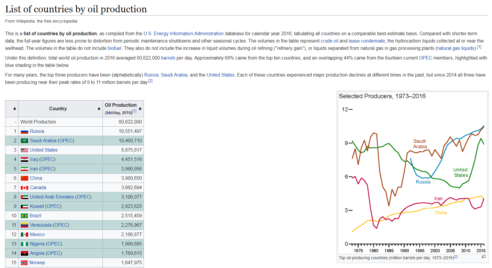
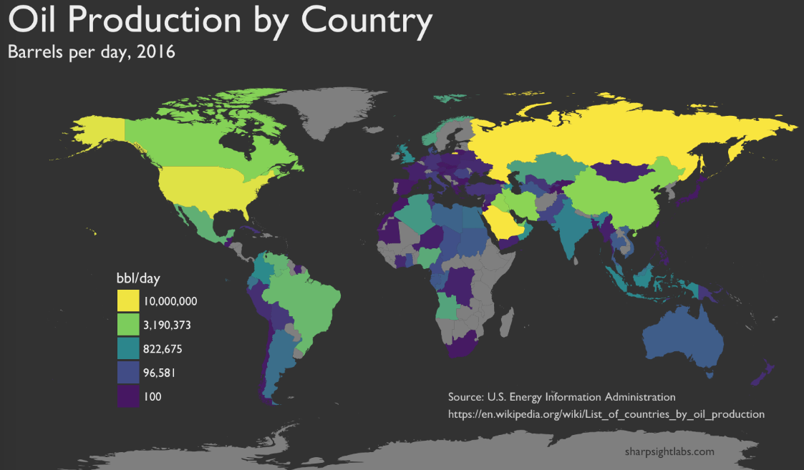
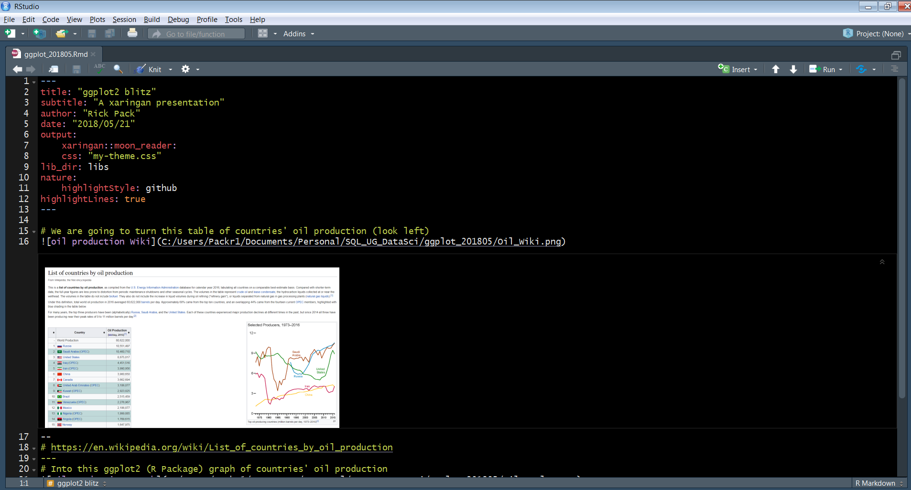
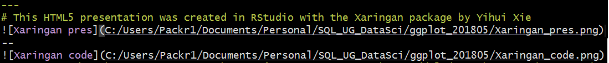
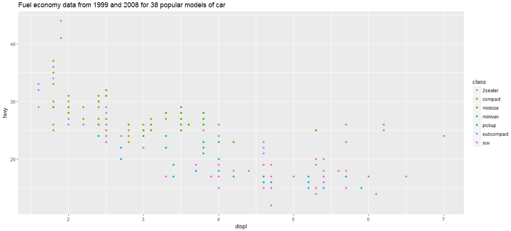
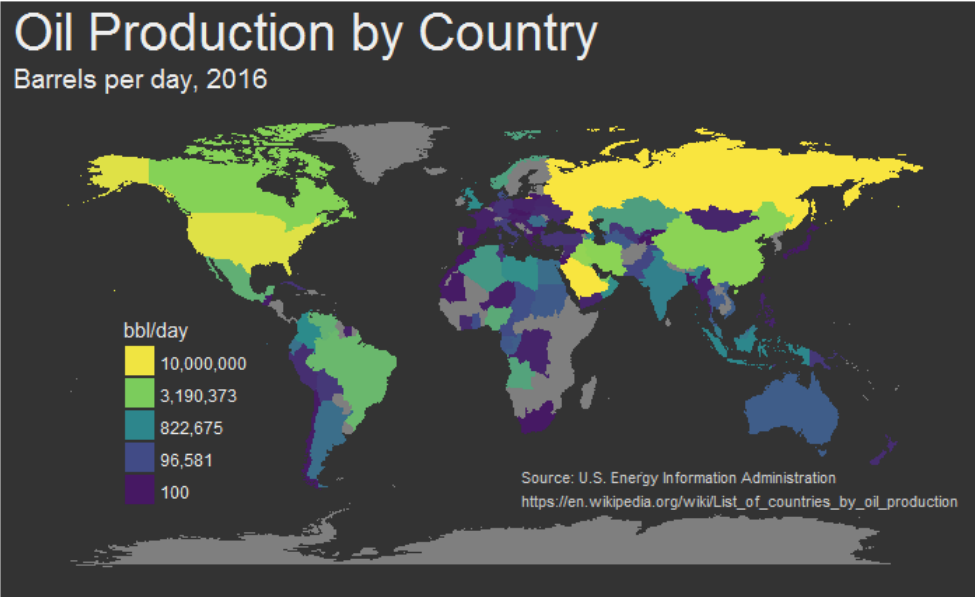
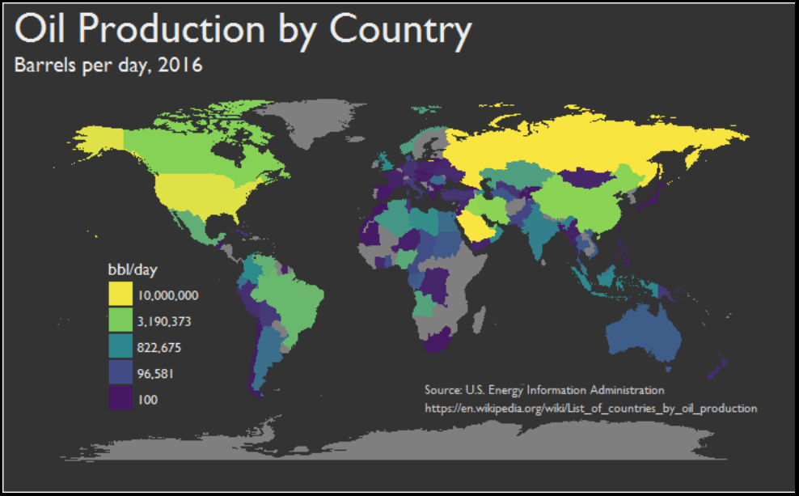
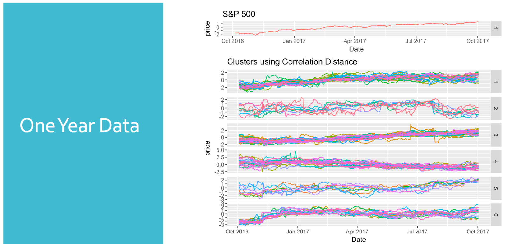

# We are going to turn this table of countries' oil production (look left)

--
# https://en.wikipedia.org/wiki/List_of_countries_by_oil_production

---
# Into this ggplot2 (R Package) graph of countries' oil production 


# http://www.sharpsightlabs.com/blog/map-oil-production-country-r/

---
# This HTML5 presentation was created in RStudio with the Xaringan package by Yihui Xie


--



# get started with Xaringan using Yihui Xie's presentation at https://slides.yihui.name/xaringan/

---
#Yihui Xie - courtesy of usethis.com


# "This code is available on my Github page: https://github.com/RickPack/TriPASS_DataSci_ggplot2_201805

---

# sharpsightlobs.com R Code (map oil production by country) [slight mod] - page 1 / X
```{r tidy=FALSE, results = 'hide'}
#=============
# LOAD PACKAGES, INSTALL IF NOT INSTALLED
#=============
list.of.packages <- c("tidyverse", "sf", "rvest", "stringr", "scales", "viridis", "extrafont", "maps","formatR")
new.packages <- list.of.packages[!(list.of.packages %in% installed.packages()[,"Package"])]
if(length(new.packages)) install.packages(new.packages, repos = "http://cran.us.r-project.org")
```

---
```{r tidy=FALSE, results = 'hide'}
#=============
# LOAD PACKAGES
#=============
# user Nate in https://stackoverflow.com/questions/14733732/cant-change-fonts-in-ggplot-geom-text #<<
# "The key for my system was to call extrafont::loadfonts(device="win") prior to library(ggplot2)."
# needed for Windows to eliminate "font family not found in Windows database error"
# in Linux use X11Fonts()
extrafont::font_import("C:/Windows/Fonts/", pattern = "GIL_____")
extrafont::loadfonts(device="win")
library(tidyverse)
library(sf)
library(rvest)
library(stringr)
# I love the percent function in the scales package
library(scales) #<<
# for color palettes: #<<
library(viridis) #<<


```

```{r tidy=FALSE, results = 'asis'}
scales::percent(3/4)
```

---
# An easily produced ggplot2 scatterplot
```{r tidy=TRUE}
# mpg is a data frame loaded when one loads the ggplot2 package (loaded in tidyverse)
ggplot(mpg, aes(displ, hwy, colour = class)) + 
  geom_point() +
  ggtitle(label = "Fuel economy data from 1999 and 2008 for 38 popular models of car",
          subtitle = "from the mpg data frame installed with ggplot2")
```

# from http://ggplot2.tidyverse.org/

---
# sharpsightlobs.com R Code (map oil production by country) [slight mod] - page 2 / X
```{r tidy=TRUE}
#============
# SCRAPE DATA
#============

df.oil <- read_html("https://en.wikipedia.org/wiki/List_of_countries_by_oil_production") %>%
  html_nodes("table") %>%
  .[[1]] %>%
  html_table()
```


---
# sharpsightlobs.com R Code (map oil production by country) [slight mod] - page 3 / X
```{r tidy=TRUE}
#====================
# CHANGE COLUMN NAMES 
#====================
print(names(df.oil))
colnames(df.oil) <- c('rank', 'country', 'oil_bbl_per_day')

#=============================
# WRANGLE VARIABLES INTO SHAPE
#=============================


#----------------------------------
# COERCE 'rank' VARIABLE TO INTEGER
#----------------------------------

# What is the class of each variable?
lapply(df.oil, class)

df.oil <- df.oil %>% mutate(rank = as.integer(rank)) 
# glimpse is installed with the tidyverse
#  See class and sampling of values
#  Commas in oil_bbl_per_day are a problem, country sometimes shows OPEC
df.oil %>% glimpse()
```


```{r tidy=TRUE}
#---------------------------------------------------
# WRANGLE FROM CHARACTER TO NUMERIC: oil_bbl_per_day
#---------------------------------------------------

df.oil <- df.oil %>% mutate(oil_bbl_per_day = oil_bbl_per_day %>% str_replace_all(',','') %>% as.integer())


#===========================
#CREATE VARIABLE: 'opec_ind'
#===========================

df.oil <- df.oil %>% mutate(opec_ind = if_else(str_detect(country, 'OPEC'), 1, 0))
df.oil <- df.oil %>% mutate(country = country %>% 
                     str_replace(' \\(OPEC\\)', '') %>% str_replace('\\s{2,}',' '))
# inspect
df.oil %>% glimpse()

#------------------------------------------
# EXAMINE OPEC COUNTRIES
# - here, we'll just visually inspect
#   to make sure that the names are correct
#------------------------------------------

df.oil %>% 
  filter(opec_ind == 1) %>%
  select(country)

#==================
# REORDER VARIABLES
#==================

df.oil <- df.oil %>% select(rank, country, opec_ind, oil_bbl_per_day)

#========
# GET MAP
#========
# map_data turns data "from the maps package in to a data frame suitable for plotting with ggplot2".
map.world <- map_data('world')

#==========================
# CHECK FOR JOIN MISMATCHES
#==========================

mismatch_frm <- anti_join(df.oil, map.world, by = c('country' = 'region'))
print(head(mismatch_frm))

#=====================
# RECODE COUNTRY NAMES
#=====================

map.world %>%
  group_by(region) %>%
  summarise() %>%
  print(n = Inf)

df.oil <- df.oil %>%  mutate(country = recode(country, 
                                   `United States` = 'USA'
                                 , `United Kingdom` = 'UK'
                                 , `Congo, Democratic Republic of the` = 'Democratic Republic of the Congo'
                                 , `Trinidad and Tobago` = 'Trinidad'
                                 , `Sudan and South Sudan` = 'Sudan'
                                 #, `Sudan and  South Sudan` = 'South Sudan'
                                 , `Congo, Republic of the` = 'Republic of Congo'
                                 )
                   )
#-----------------------
# JOIN DATASETS TOGETHER
#-----------------------

map.oil <- left_join( map.world, df.oil, by = c('region' = 'country')) 

#=====
# PLOT
#=====

# BASIC (this is a first draft)

ggplot(map.oil, aes( x = long, y = lat, group = group )) +
  geom_polygon(aes(fill = oil_bbl_per_day))
  
# Top 5 countries 
map.oil %>% distinct(rank, region) %>% top_n(-5, rank) %>% arrange(rank) %>% select(region)
  
# PROFESSIONAL ELEGANCE (this is a first draft)
  
gill_map <-
 ggplot(map.oil, aes( x = long, y = lat, group = group )) +
  geom_polygon(aes(fill = oil_bbl_per_day)) +
  scale_fill_gradientn(colours = c('#461863','#404E88','#2A8A8C','#7FD157','#F9E53F')
                       ,values = scales::rescale(c(100,96581,822675,3190373,10000000))
                       ,labels = comma
                       ,breaks = c(100,96581,822675,3190373,10000000)
                       ) +
  guides(fill = guide_legend(reverse = T)) +
  labs(fill = 'bbl/day'
       ,title = 'Oil Production by Country'
       ,subtitle = 'Barrels per day, 2016'
       ,x = NULL
       ,y = NULL) +
  theme(text = element_text(family = 'Gill Sans MT', color = '#EEEEEE')
        ,plot.title = element_text(size = 28)
        ,plot.subtitle = element_text(size = 14)
        ,axis.ticks = element_blank()
        ,axis.text = element_blank()
        ,panel.grid = element_blank()
        ,panel.background = element_rect(fill = '#333333')
        ,plot.background = element_rect(fill = '#333333')
        ,legend.position = c(.18,.36)
        ,legend.background = element_blank()
        ,legend.key = element_blank()
        ) +
  annotate(geom = 'text'
           ,label = 'Source: U.S. Energy Information Administration\nhttps://en.wikipedia.org/wiki/List_of_countries_by_oil_production'
           ,x = 18, y = -55
           ,size = 3
           ,family = 'Gill Sans MT'
           ,color = '#CCCCCC'
           ,hjust = 'left'
           )
orig_map <-
 ggplot(map.oil, aes( x = long, y = lat, group = group )) +
  geom_polygon(aes(fill = oil_bbl_per_day)) +
  scale_fill_gradientn(colours = c('#461863','#404E88','#2A8A8C','#7FD157','#F9E53F')
                       ,values = scales::rescale(c(100,96581,822675,3190373,10000000))
                       ,labels = comma
                       ,breaks = c(100,96581,822675,3190373,10000000)
                       ) +
  guides(fill = guide_legend(reverse = T)) +
  labs(fill = 'bbl/day'
       ,title = 'Oil Production by Country'
       ,subtitle = 'Barrels per day, 2016'
       ,x = NULL
       ,y = NULL) +
  theme(text = element_text(color = '#EEEEEE')
        ,plot.title = element_text(size = 28)
        ,plot.subtitle = element_text(size = 14)
        ,axis.ticks = element_blank()
        ,axis.text = element_blank()
        ,panel.grid = element_blank()
        ,panel.background = element_rect(fill = '#333333')
        ,plot.background = element_rect(fill = '#333333')
        ,legend.position = c(.18,.36)
        ,legend.background = element_blank()
        ,legend.key = element_blank()
        ) +
  annotate(geom = 'text'
           ,label = 'Source: U.S. Energy Information Administration\nhttps://en.wikipedia.org/wiki/List_of_countries_by_oil_production'
           ,x = 18, y = -55
           ,size = 3
           ,color = '#CCCCCC'
           ,hjust = 'left'
           )
gill_map
```           

---
# Default [ (theme_get() ] vs. Gill Sans font
## font family not found in Windows font database

--
## Gill Sans after 


---
# Same but using grid.arrange from the gridExtra package
```{r tidy=FALSE}
if (!require("grid")) install.packages("grid", repos = "http://cran.us.r-project.org")
if (!require("gridExtra")) install.packages("gridExtra", repos = "http://cran.us.r-project.org")
gridExtra::grid.arrange(orig_map, gill_map , nrow = 2, heights = c(2,2)) 
```
---
# also see grid.arrange in the code from the "Applying Data Science fundamentals to Stock Market Data" 
# TriPASS Data Sci presentation by Conrad D'Cruz and Yin-Ting Chou



# https://github.com/choux130/EU_TSClustering_101117/blob/master/TSClustering/code_1024/execute_funs.R
# https://www.meetup.com/tripass/events/244117529/

---
# References
* http://www.sharpsightlabs.com/blog/map-public-debt-ggplot2/
* http://www.sharpsightlabs.com/blog/map-oil-production-country-r/
* https://www.rstudio.com/wp-content/uploads/2016/03/rmarkdown-cheatsheet-2.0.pdf